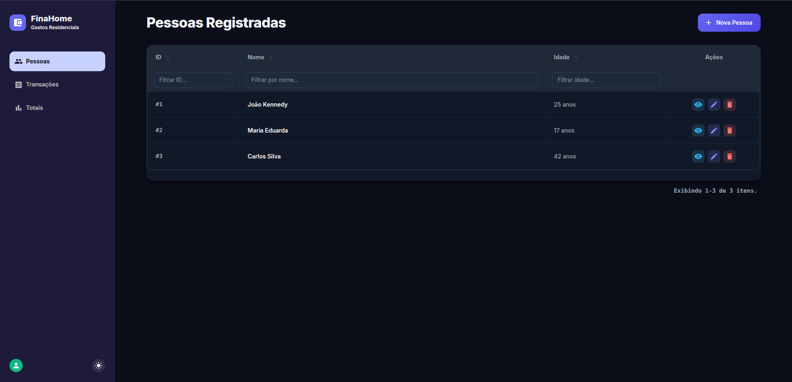
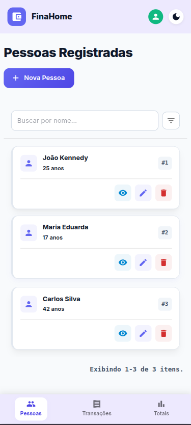
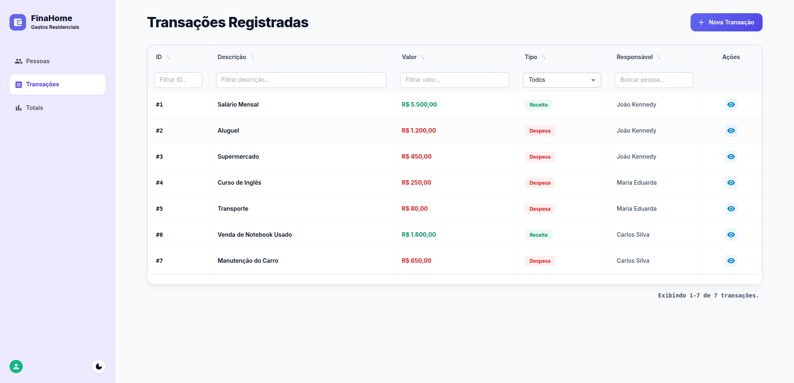
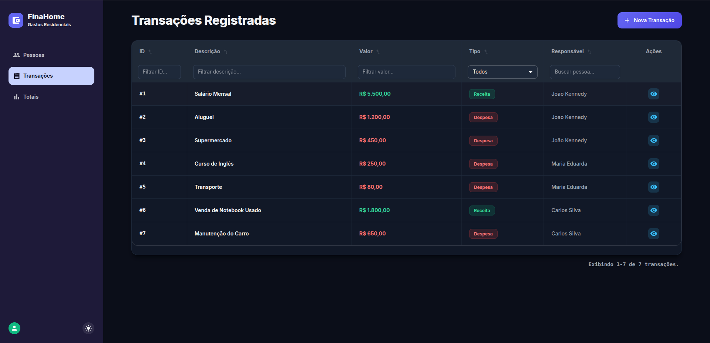
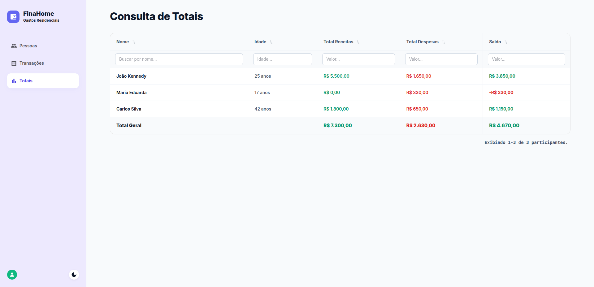
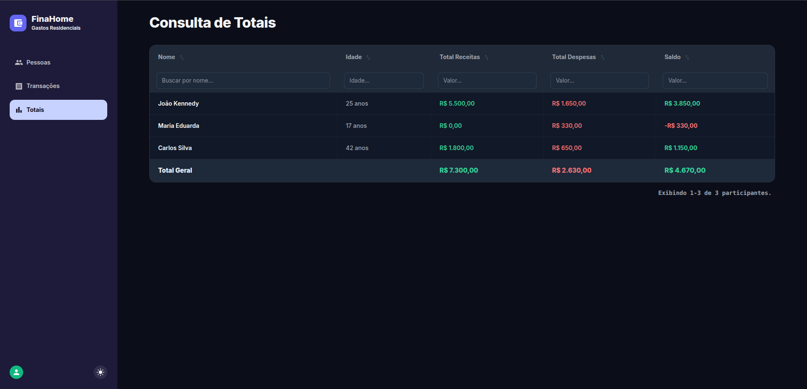
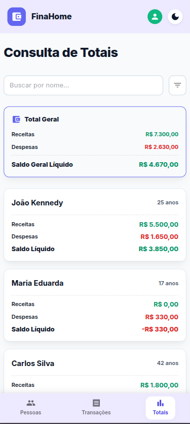

# FinaHome - Controle de Gastos Residenciais


O **FinaHome** é um sistema para controle financeiro doméstico desenvolvido como solução para teste técnico. A aplicação permite o gerenciamento de participantes, lançamento de movimentações (receitas e despesas) e visualização de saldos consolidados por indivíduo e gerais.

## Stack Técnica

- **Backend:** .NET 10 (Web API), Entity Framework Core, SQLite
- **Frontend:** React 18, TypeScript, Vite, Material UI (MUI)

## Funcionalidades e Regras de Negócio

1. **Cadastro de Pessoas**
   - Criação, listagem e remoção de participantes.
   - **Exclusão em cascata:** A remoção de uma pessoa deleta automaticamente todas as suas transações vinculadas no banco de dados.

   | Desktop Claro | Desktop Escuro | Mobile |
   | :---: | :---: | :---: |
   |  |  |  |

2. **Cadastro de Transações**
   - Criação e listagem de movimentações financeiras.
   - **Restrição de menor de idade:** Usuários com menos de 18 anos só podem registrar transações do tipo "Despesa".

   | Desktop Claro | Desktop Escuro | Mobile |
   | :---: | :---: | :---: |
   |  |  |  |

3. **Consulta de Totais**
   - Tabela consolidada com soma de receitas, despesas e saldo líquido de cada pessoa.
   - Indicador geral exibindo os totais acumulados da residência no rodapé.

   | Desktop Claro | Desktop Escuro | Mobile |
   | :---: | :---: | :---: |
   |  |  |  |

4. **Experiência e Responsividade**
   - Suporte a alternância de tema Claro/Escuro (Dark Mode).
   - Componentes específicos para mobile (`PersonMobileList`, `TransactionMobileList`, `TotalsMobileList`) exibidos via breakpoints de tela para melhor legibilidade em celulares.

## Como Executar o Projeto

### Pré-requisitos
- .NET SDK 10
- Node.js (v18 ou superior)

### 1. Rodar o Backend

A partir da raiz do projeto, navegue até a pasta do servidor e inicie a API:

```bash
cd backend
dotnet run
```

A API iniciará no endereço `http://localhost:5242`. 

#### Inicialização e Seed do Banco de Dados
* O banco de dados SQLite (`gastos.db`) é criado e estruturado com as migrações automaticamente ao iniciar.
* **Execução Padrão:** Ao rodar `dotnet run`, o sistema inicia com o banco de dados conforme o último estado salvo. Os dados persistem após fechar a aplicação.
* **Populando com Dados Iniciais:** Para preencher a base com os 3 participantes padrão e suas respectivas receitas e despesas, inicie a API utilizando a flag `--seed`:
  ```bash
  dotnet run --seed
  ```
  *Nota: O seed é totalmente **idempotente**. Ele não apaga dados existentes do banco e não duplica registros já semeados anteriormente. Se você adicionar novos dados ao seed e rodar o comando novamente, apenas os novos registros serão inseridos.*

### 2. Rodar o Frontend

Em outro terminal, acesse a pasta do frontend, instale as dependências e inicie o servidor local:

```bash
cd backend/frontend
npm install
npm run dev
```

O painel administrativo estará acessível no navegador através de `http://localhost:5173`.
